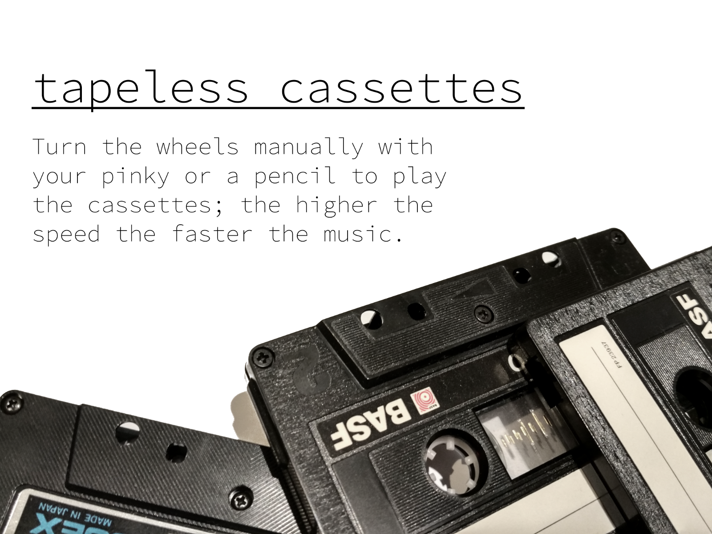
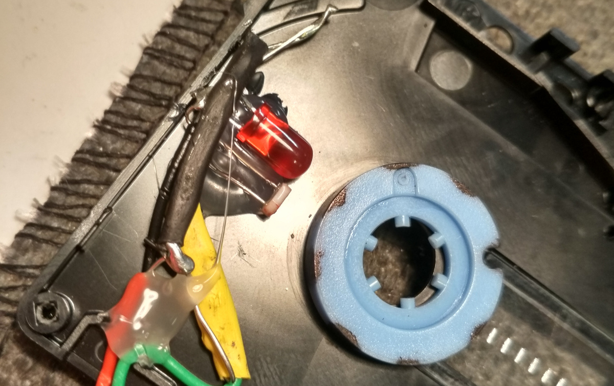

## What?

CruftFest 2016 project / an assignment to the Interactive Digital Multimedia Techniques (IDMT) module, Media and Arts Technology, Queen Mary University of London.

## The task

_cruft: accumulated physical or virtual junk._

Save a small amount of cruft from the dump by repurposing it as a digital media interface.

## The concept

To use audio cassettes as controllers for interactive, collaborative, musical interface. Users will manually turn the cassettes wheels, with their pinky or a pencil, to control the speed of pre-composed audio track/loop; the higher the speed of the wheel, the faster the music. With multiple audio cassettes, a group of users will be able to play together, when each one control different aspect of the music.

## The hardware

I built the sensor to read the speed of the audio cassette wheel using an LED and a photocell. The LED, which is constantly on, and the photocell are glued side by side, inside the audio cassette, pointing to the wheel. The wheel is marked with eight black stripes on its circumference, using a marker. With this arrangement, the photocell resistance is higher when there is a black stripe in front of it. Note that everything is assembled inside the cassette so there is a minor interference of external light.

## The code

A simple arduino sketch repeatedly reads the photocell voltage and send it in serial to the computer.

A python script reads the serial data, accumulate it into a buffer over time, apply FFT to it, and extract the peaked bin number, which is correlated to the wheel speed. Note that this type of analysis is very robust against changes in light conditions, as the DC bin in the spectrum is always ignored. The peak bin number is then sent for further handling using OSC.

A Pd patch is listening to OSC messages and changes the speed of the audio according accordingly.

## How to run the project

- Connect the cassettes to the arduino.
- Upload the sketch to arduino.
- Run the python script. Run with `--help` to see the available options.
- Optionally run the processing monitoring application.
- Run the Pd patch.

## Audio sources

- Freesound samples for the "cluster cassette": [1](https://freesound.org/people/MTG/sounds/359443/), [2](https://freesound.org/people/MTG/sounds/358439/), [3](https://freesound.org/people/MTG/sounds/361080/), [4](https://freesound.org/people/Carlos_Vaquero/sounds/154278/), [5](https://freesound.org/people/Vlad99/sounds/212989/), [6](https://freesound.org/people/MTG/sounds/360251/), [7](https://freesound.org/people/TaranP/sounds/361396/), [8](https://freesound.org/people/xserra/sounds/77763/), [9](https://freesound.org/people/MTG/sounds/354228/).
- [Highlights from the 2016 elections debate](https://www.youtube.com/watch?v=mywnPddVYHY).
- The first bar of Led Zeppelin's "When the levee breaks".
