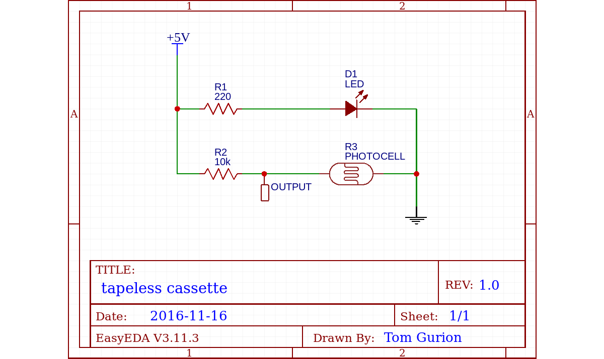

# The hardware

The hardware includes 3 audio cassettes, stripped from their magnetic tape. Inside each tape there is a circuit to measure the speed of the wheel. Figure \ref{circuit} shows the assembled circuit inside a cassette. It is based on a constantly on LED and a photocell sensor that are directed towards the cassette wheel. The wheel is marked with stripes on its circumference. This way, when the wheel rotates, the voltage measured from the photocell leg raises and falls periodically. A schematic diagram of the electronic circuit is presented in figure \ref{diagram}.

# The software

Three main technologies are used in this project: arduino for connectivity with the physical world, python for sensor data analysis, and pure data (Pd) as an audio engine.

## Arduino sketch

The cassettes' circuit output (see figure \ref{diagram}) are connected to analog pins 1 to 3 on the arduino board. A simple sketch repeatedly read these pins and transmit the data over the serial port to the computer as a comma separated string.

## Python script

A python script measures the speed of the wheels based on the photocell readings. It applies FFT on 128 samples buffer, removes DC, finds the peaked bin in the spectrum, and if it's above a certain threshold (found by trail and error) sends the index of the bin over OSC for further handling. If the peaked bin is below the threshold the value 0 is sent instead, indicating that there is no movement. Note that the result of this is not an exact measure of the speed in any way, but it is correlated to it, which is enough for the expected type of interaction. The described solution worked but is not ideal. Sea further note on the subject in the "Reflections and future modifications" section below.

## Pd patch

A Pd patch receives OSC messages containing speed indication for each of the cassettes. It smooths the values with linear ramps of 150 milliseconds and sends them to sub-patches that generate audio in a loop. The musical content of the sub-patches is:

- A "cluster" of acoustic instruments, all of them playing the same note (G). The cassettes speed, and the affected pitch, are inherently unstable. The single note fluctuate so much that it is impossible to tell which instruments are heard.
- The first bar of Led Zeppelin's "when the levee breaks". The drums in this song are very distinctive. Surprisingly, despite the fluctuations in speed and pitch the drums are recognized easily.
- Excerpts from the USA 2016 elections debate. It is immediately obvious that the sound is of speech, but it is hard to separate between the speakers.

The three different musical materials demonstrate different effects of instability of speed and pitch, which are usually not presented in music. More details about the audio sources is available in later section.

## Additional software tools

During the development of the project I wrote two helper software tools.

- Figure \ref{monitor} presents a processing monitoring sketch. It is used to visually monitor the output of the python script and debug it. In addition to the peaked bin, the original buffer of samples and the resulted spectrum are presented.
- A BBC micro:bit simulator is used to mock the cassettes and arduino parts of the system by generating similar signal using random processes. Again, the main purpose is to debug the python script effectively.

# Reflections and future modifications

## Extracting a fundamental frequency

The python script measured the speed of the wheel by choosing the peaked bin in a spectrum. This is far from being the optimal way of finding the fundamental frequency of a wave. Time domain approaches (e.g. the [YIN algorithm](http://audition.ens.fr/adc/pdf/2002_JASA_YIN.pdf)) might be more appropriate for the task.

## Different types of interactions

During CruftFest I observed several unexpected interactions between the participants and the project. First, participants often turned the wheels much faster than the tested speeds and outside of the ranges of the system, breaking the sense of control over the music speed. Second, and despite my attempt to make the project playable by a group of people, most of the participants interacted with it individually. However, people often tried to play more than one cassette simultaneously by either playing two cassettes with two hands or by using the same pen to control more than one cassette. This later behavior is interesting because it might suggest implementing some type of synchronization mechanism between cassettes when the are played in similar speed, extending the types of interactions possible with this project.

# Audio sources

- Freesound samples for the "cluster cassette": [1](https://freesound.org/people/MTG/sounds/359443/), [2](https://freesound.org/people/MTG/sounds/358439/), [3](https://freesound.org/people/MTG/sounds/361080/), [4](https://freesound.org/people/Carlos_Vaquero/sounds/154278/), [5](https://freesound.org/people/Vlad99/sounds/212989/), [6](https://freesound.org/people/MTG/sounds/360251/), [7](https://freesound.org/people/TaranP/sounds/361396/), [8](https://freesound.org/people/xserra/sounds/77763/), [9](https://freesound.org/people/MTG/sounds/354228/).
- [Highlights from the 2016 elections debate](https://www.youtube.com/watch?v=mywnPddVYHY).
- The first bar of Led Zeppelin's "When the levee breaks".

# External references

- Source code for the project can be found [on github](https://github.com/Nagasaki45/TapelessCassettes).
- See [my portfolio website](http://www.tomgurion.me/tapeless-cassettes.html) for online review of the project.
